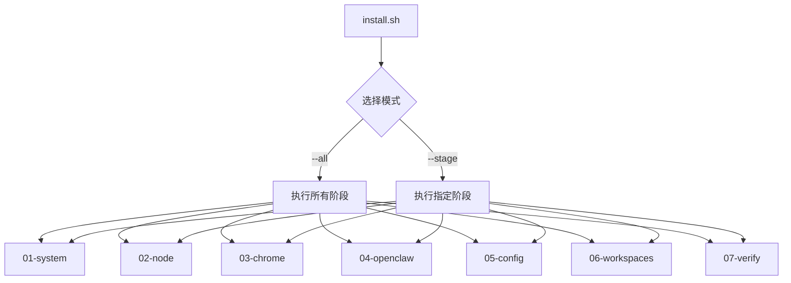

# OpenClaw 一键恢复脚本 - 项目概述

## 目标

在全新 Ubuntu 虚拟机上，基于国内网络环境，一键恢复 OpenClaw-CN 完整配置。

## 架构



## 恢复内容

| 组件 | 版本 | 来源 |
|------|------|------|
| Node.js | v24.14.0 | NVM |
| Chrome | latest | Google 官方 .deb |
| OpenClaw | 0.1.8-fix.3 | npm (淘宝镜像) |
| Workspace | 5 个 | 本地/Git |
| Obsidian | - | GitHub |

## 敏感信息处理

- 占位符格式：`{{VARIABLE_NAME}}`
- 注入方式：环境变量 / .env 文件 / 交互式输入
- 权限设置：`chmod 600 openclaw.json`

## 使用方式

```bash
# 完整安装
./scripts/install.sh --all

# 分阶段安装
./scripts/install.sh --stage node

# 交互式配置
./scripts/install.sh --all --interactive
```
